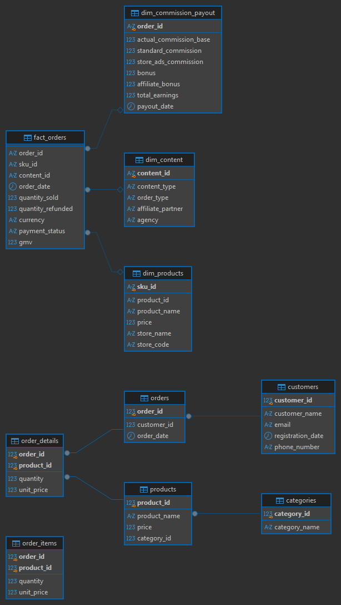

# TikTok Affiliate E-Commerce Data Pipeline & Analytics

## Business Overview
This project delivers an end-to-end relational data pipeline based on a **Star Schema** architecture and performs advanced business analytics for a TikTok Affiliate e-commerce ecosystem. The analysis covers Gross Merchandise Value (GMV) revenue trends, content channel performance (*LIVE Streams vs Short Videos*), affiliate partner tiering, and product refund rate quality checks.

---

## Data Architecture & Relational Schema (ERD)
Unstructured raw order data was cleaned, normalized, and structured into a **Star Schema** to optimize SQL join efficiency and query performance in PostgreSQL.



### **Relational Tables Schema:**
* **`fact_orders`**: Central fact table capturing order transactions, quantities, payment status, and revenue (GMV).
* **`dim_products`**: Dimension table storing SKU details, product names, prices, and store codes.
* **`dim_content`**: Dimension table classifying promotional channels (LIVE, Showcase, Short Video, and Agencies).
* **`dim_commission_payout`**: Dimension table recording affiliate commission breakdowns, bonuses, and payout dates.

---

## Data Pipeline Integrity & Validation Test
To ensure zero data loss during data transformation, staging, and ingestion into PostgreSQL, a full re-join test was performed across all 4 relational tables:

```sql
SELECT COUNT(*) AS total_rows_joined
FROM fact_orders f
LEFT JOIN dim_products p ON f.sku_id = p.sku_id
LEFT JOIN dim_content c ON f.content_id = c.content_id
LEFT JOIN dim_commission_payout pay ON f.order_id = pay.order_id;
```
Key Business Insights (SQL Queries)
1. Top 5 Best-Selling Products (by GMV)
Sepatu Retrograde Low Black White drove the highest GMV contribution, generating IDR 280.9M across 1,060 units sold.

Sepatu Gazelle Low Black White ranked second with IDR 245.7M GMV across 1,213 units sold.

2. Monthly Sales Trend (Month-over-Month Growth)
Peak revenue occurred in June 2026, generating IDR 85.3M GMV.

Window functions (LAG()) identified seasonal demand spikes and growth rebounds during mid-year promotional campaigns.

3. Content Channel Performance
LIVE Streaming is the primary revenue driver, accounting for 5,772 orders and IDR 1.75B GMV (~88% of total revenue).

Showcase and Short Video content contributed IDR 201M and IDR 119M, respectively.

4. Affiliate Partner Performance Tiering
Using SQL quartile functions (NTILE(4)), Affiliate_-1 was categorized under Tier 1 (Top Performance) with total commission earnings of IDR 70.2M.

5. Product Quality & Refund Rate Analysis
All core SKUs exhibited a 0% Refund Rate, indicating high customer satisfaction and optimal product delivery standards.

Tech Stack & Methodology
- Python (Pandas, NumPy): Data Cleaning, Deduplication, Categorization, & Star Schema Normalization.
- PostgreSQL & DBeaver: Relational Database Design, Schema Definition (DDL), & Foreign Key Constraints.
- Advanced SQL: Window Functions (RANK, LAG, NTILE), Common Table Expressions (CTEs), & Multi-Table Joins.
- Version Control & Documentation: GitHub Markdown & ERD Diagram Export.
